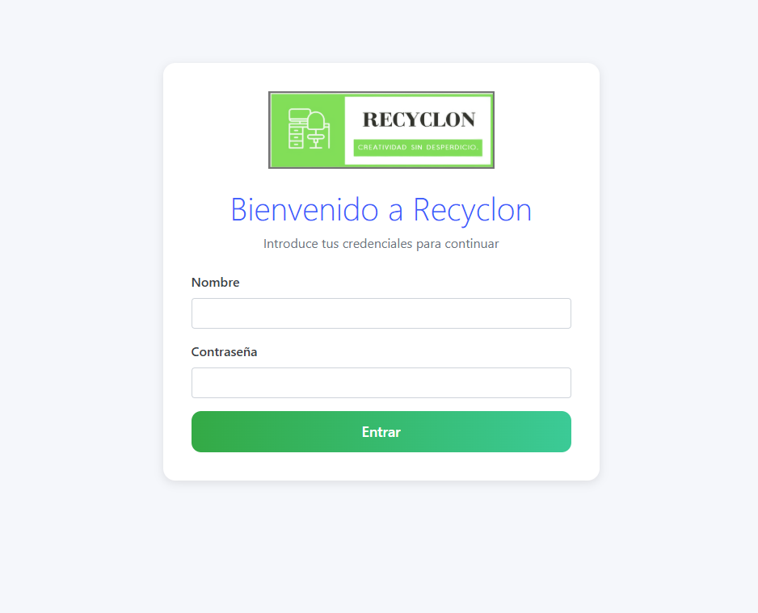
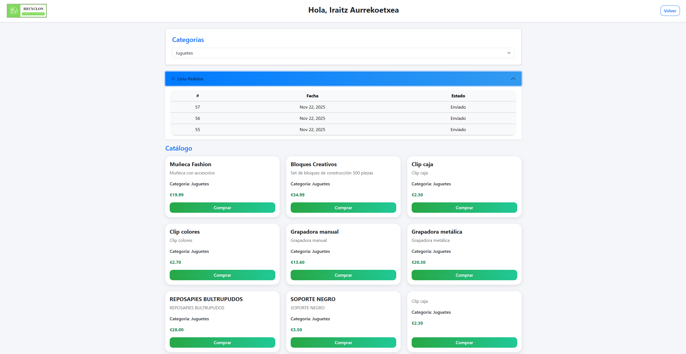
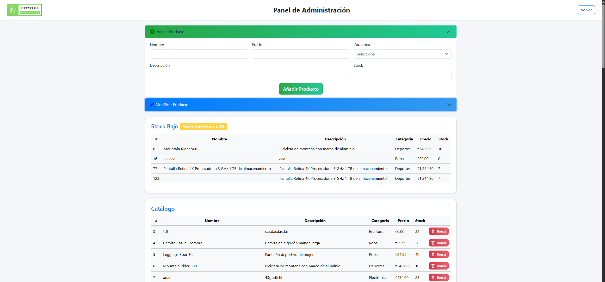

# 🧾 Recyclon — Gestión de Productos y Pedidos

Aplicación web desarrollada con **Jakarta EE**, **JPA (Hibernate)** y **Bootstrap 5**, orientada a la gestión interna de productos reciclados y sostenibles. Permite administrar el catálogo, registrar pedidos y realizar consultas personalizadas mediante JPQL.

---

## 📑 Índice

1. [Despliegue](#despliegue)  
2. [Capturas de Pantalla](#capturas-de-pantalla)  
   - [Pantalla de Login](#pantalla-de-login)  
   - [Vista del Usuario Normal](#vista-del-usuario-normal)  
   - [Vista del Administrador](#vista-del-administrador)  
3. [Operaciones Básicas](#operaciones-basicas)  
   - [Productos](#productos)  
   - [Pedidos](#pedidos)  
   - [Consultas JPQL](#consultas-jpql)  
4. [Arquitectura del Proyecto](#arquitectura-del-proyecto)  
5. [Entidades Principales](#entidades-principales)  
6. [Interfaz Visual](#interfaz-visual)

---

<h2 id="despliegue">🚀 Despliegue</h2>

Para ejecutar la aplicación:

1. Ejecutar **Run on Server** sobre el archivo `ControladorRecyclon.java`.

<h3 id="credenciales-de-acceso">🔐 Credenciales de acceso</h3>

- **Usuario Normal:**  
  - Usuario: `Asier`  
  - Contraseña: `usuario123`

- **Administrador:**  
  - Usuario: `Admin`  
  - Contraseña: `admin123`

---

<h2 id="capturas-de-pantalla">🖼️ Capturas de Pantalla</h2>

<h3 id="pantalla-de-login">🔑 Pantalla de Login</h3>

  

<h3 id="vista-del-usuario-normal">👤 Vista del Usuario Normal</h3>

  

<h3 id="vista-del-administrador">🛠️ Vista del Administrador</h3>

  

---

<h2 id="operaciones-basicas">🛠️ Operaciones Básicas</h2>

<h3 id="productos">📦 Productos</h3>

- Listar el catálogo completo, con filtro por categoría.  
- Crear un nuevo producto mediante formulario.  
- Modificar productos existentes.  
- Eliminar productos del catálogo.

<h3 id="pedidos">🧾 Pedidos</h3>

- Registrar un nuevo pedido, seleccionando productos directamente del catálogo.  
- Consultar pedidos existentes, mostrando id, fecha y estado.

<h3 id="consultas-jpql">🔎 Consultas JPQL</h3>

- Productos con stock bajo.

---

<h2 id="arquitectura-del-proyecto">🧱 Arquitectura del Proyecto</h2>

- **Patrón MVC clásico**
  - Controlador principal: `ControladorRecyclon`.  
  - Modelo: Entidades JPA.  
  - Vista: JSP con Bootstrap 5.

- **Persistencia**
  - JPA con unidad de persistencia `recyclonPU`.  
  - Base de datos SQL Server usando Hibernate (`hibernate-core-jakarta 5.6.15`).  

---

<h2 id="entidades-principales">🗃️ Entidades Principales</h2>

### Usuarios
Representa a los clientes del sistema.

**Campos:** `id`, `nombre_usuario`, `contra`, `apellidos`, `admin`.  

**Relación:** un usuario puede tener muchos pedidos (1:N).

---

### Pedidos
Representa un pedido realizado por un usuario.

**Campos:** `id`, `fechaPedido`, `estado`, `id_cliente`.  

**Relaciones:**  
- Cada pedido pertenece a un usuario (N:1).  
- Cada pedido tiene varias líneas de pedido (1:N con LineaPedidos).

---

### LineaPedidos
Representa cada producto dentro de un pedido.

**Campos:** `id`, `cantidad`, `precioUnitario`, `id_pedido`, `id_producto`.  

**Relaciones:**  
- Cada línea pertenece a un pedido (N:1).  
- Cada línea referencia un producto (N:1).

---

### Productos
Información de los artículos vendidos.

**Campos:** `id`, `nombre`, `descripcion`, `precioUnitario`, `stock`, `id_categoria`.  

**Relaciones:**  
- Un producto puede aparecer en muchas líneas de pedido (1:N con LineaPedidos).  
- Cada producto pertenece a una categoría (N:1).

---

### Categorias
Clasifica los productos.

**Campos:** `id`, `nombre_categoria`.  

**Relación:** una categoría puede tener muchos productos (1:N).

---

<h2 id="interfaz-visual">🎨 Interfaz Visual</h2>

Construida con **Bootstrap 5.3.2**, usando:

- Navbars  
- Cards  
- Tablas  
- Badges 
- Alerts
- Accordion
- Diseño **responsive**
